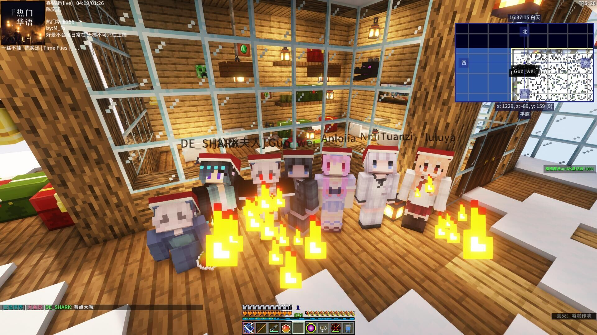

# 宣传页

这是一个 1.19.2 版本，稍微硬核一些些的科技服务器

在这里，集成了众多优秀的模组，并设计复杂的、科学的、完整的科技进阶路线。你可以探索到各种各样的科技设备和机械，制造出各种各样的科技产品和材料，还可以学会一些有用的科学知识。

拥有圈地玩法和空岛玩法，你可以按照喜好来挑选在哪里建造属于自己的自动化工厂！

测试服中的玩家工厂：

同时，服务器拥有着丰富多样的地形，超过 85 个全新的群系，并用新特色翻新了几乎每个原版生物群系，拥有更加真实的四季系统，昼夜长短对应着一年四季不断变化，同时改善它们原来的特点。

在不背离原版体素风格的的基础上，添加具有更多细节的原木方块。它们较为真实的还原了树木的外貌。包括粗细，树根，甚至随机的生长方向和向光的特性。

服务器添加了二十多种村庄变体，与十多种掠夺者哨塔变体，而原版的村庄也全部都被改进了。对应的生物群系有与之对应的村庄变体，如丛林中有树屋，而蘑菇岛就有蘑菇建造的屋子。村庄的外观以及内部的各个小建筑拥有着非常多的细节，每个建筑内也有一定数量的内饰。

这里有比你在原版中发现的山脉大得多的山脉，可以持续数千个区块的地下河，以及更有趣的地形生成。

服务器开荒中并且将不断更新，期待并欢迎更多的玩家伙伴加入到彼岸之上大家庭，一同成长，无限进步！

快来加入我们吧，让我们一起探索一个不一样的世界！

