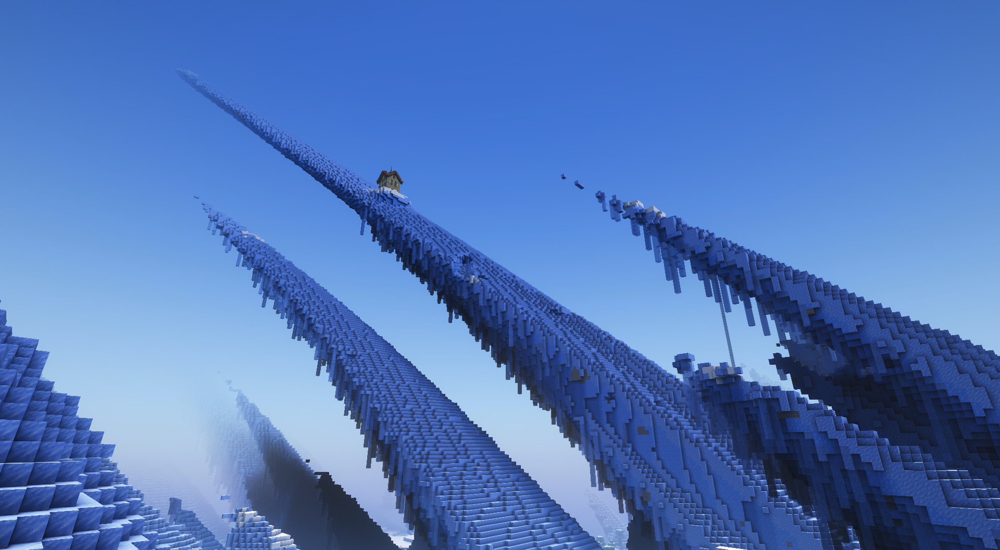

# 宣传页

这是一个 1.18.2 版本，稍微硬核一些些的科技服务器

彼岸之上是一个高科技的我的世界服务器，它集成了众多优秀的模组，设计了独一无二的科技进阶路线。在这里，你可以探索到各种各样的科技设备和机械，制造出各种各样的科技产品和材料，还可以学会一些有用的科学知识。

拥有圈地玩法和空岛玩法，你可以按照喜好来挑选在哪里建造属于自己的自动化工厂！

玩家工厂截图：

同时，彼岸之上也是一个全新的我的世界服务器，它拥有丰富的地形和生物，多样的任务和活动，自由的建筑和装饰。在这里，你可以尽情地展现你的才华和个性，体验你的梦想和想象，享受你的乐趣和挑战。

快来加入我们吧，让我们一起探索一个不一样的世界！

